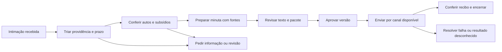

# Causor: diagnóstico do produto e dos fluxos

Data: 04/09/2026. Base de código: commit `86056eb`, árvore inicialmente limpa.

> Fotografia anterior às correções. Após este diagnóstico, o fundador autorizou a execução e informou que ainda não tem acesso a nenhum tribunal. Consulte o [registro da implementação](../produto/execucao-2026-09-04.md) para o estado posterior; os achados abaixo preservam as evidências da revisão inicial.

**Conclusão: vale preservar a arquitetura, mas o fluxo principal ainda está desconectado em pontos essenciais. A prioridade é fazer uma modalidade de trabalho funcionar de ponta a ponta, com qualidade medida por um advogado, antes de ampliar tribunais ou trocar todos os agentes.**

O fundador informou nesta análise que desenvolve sozinho e não dispõe de estimativa de clientes. Tribunal, especialidade, volume mensal, orçamento e disponibilidade atual de um advogado parceiro não foram confirmados. TJTO/eproc aparece no histórico; não foi assumido como piloto atual.

Este documento registra fatos de código e propostas na data da revisão inicial. Não representa homologação jurídica, auditoria de segurança exaustiva ou validação da instalação em produção.

Leitura complementar: [pesquisa de mercado](pesquisa-mercado-2026-09-04.md) e [plano de execução e avaliação do Astra](../produto/plano-evolucao-2026-09-04.md).

## O que foi examinado

- Orientação do repositório, estado, PRD, pesquisas anteriores e plano de agosto.
- Captura DJEN/DataJud, normalização, registro e cálculo de prazos.
- Upload, manifesto, integridade, extração/OCR, resumos, busca e contexto.
- Classificação, redação, abstração de LLM e assistente com ferramentas.
- API de revisão/aprovação/protocolo, pacote e renderização de PDF.
- Agente local, registry, cobertura, resolução de acesso e canal MNI.
- Fila de jobs, CLI, alertas, configuração de deploy e CI.
- Componentes de interface envolvidos nesses fluxos e testes associados.

A interface foi examinada pelo código, sem sessão visual autenticada. Não foram consultados banco de produção, credenciais, autos reais ou logs do escritório; nenhum protocolo, contratação ou contato externo foi feito. Testes locais não demonstram compatibilidade com portais reais.

## 1. Mapa do estado real

| Capacidade | Evidência encontrada | Estado que podemos afirmar |
|---|---|---|
| Capturar publicações por OAB | Clientes DJEN/DataJud, paginação, persistência, agendamento e testes | Implementação existente; disponibilidade e cobertura atuais não homologadas nesta análise |
| Descobrir toda a carteira pela OAB | Captura DJEN cria processos a partir das comunicações encontradas | Não equivale a inventariar todos os processos ativos, inclusive sem publicação na janela |
| Calcular datas | Motor determinístico e calendário nacional | A aritmética existe; a duração, a natureza do ato e o calendário aplicável ainda precisam de controle |
| Receber autos por upload | Manifesto, hash, armazenamento e jobs de extração | Caminho implementado para os arquivos entregues; não comprova integralidade do tribunal |
| Extrair texto e OCR | PyMuPDF, Tesseract, trechos por página | Implementado, com limites importantes de formatos e páginas |
| Resumir e montar contexto | Funções e testes dedicados | **Não conectados ao fluxo normal de processamento** |
| Gerar minuta | Classificador + contexto pronto + redator + persistência | Implementado, mas depende do contexto que falta orquestrar; override permite caminho excepcional |
| Entrar no tribunal pelo computador | Pareamento, perfil persistente, detecção de login | Infraestrutura existente; login não demonstra leitura ou protocolo |
| Ler/preparar via agente local | Handlers e registry | **Handlers não implementam a execução real** |
| Ler via MNI | Cliente SOAP, reader, executor e perfis | Implementação existente; credenciamento e entrega real permanecem dependências externas |
| Protocolar | Conector PJe legado, simuladores, jobs e confirmação manual | Registro manual disponível; fluxo real do agente não operacional no código examinado |
| Auditoria | Tabela e registros de eventos | Rastreabilidade em aplicação; imutabilidade forte não demonstrada |
| Alertar por e-mail | SMTP, deduplicação, CLI | Implementado; configuração, observabilidade e semântica de entrega exigem correção |

Há ativos que merecem ser preservados: FastAPI/Next.js/Postgres, autenticação por escritório, contratos de conectores, manifesto e hashes, armazenamento privado, revisão humana, calendário determinístico e testes. Reescrever tudo descartaria trabalho útil.

## 2. Achados prioritários

### D01 — O pipeline não chega automaticamente ao contexto pronto · P0

Em `backend/app/cli.py:282`, `process-autos-due` executa captura MNI, extração de documentos e descarte. Não executa resumos nem construção de contexto.

`summarize_document` existe em `backend/app/autos/summarizer.py:80` e `build_process_context` em `backend/app/autos/context.py:89`. A busca em `backend/app` encontra as definições, mas nenhum chamador dessas funções. Os testes de contexto chamam as etapas diretamente.

**Consequência:** arquivo recebido e extraído não progride, pelo fluxo normal examinado, para `ContextoProcesso.ready`. O gate da minuta depende desse registro. Isso é uma lacuna de integração interna, mesmo quando o advogado fornece os autos e nenhum tribunal precisa ser acessado.

**Correção proposta:** encadear `process_document → summarize_document → build_process_context`, com persistência, retomada por etapa e invalidação quando entrar uma nova versão. Criar um teste que parta do upload HTTP e atravesse os workers, substituindo somente o transporte externo do LLM. Não usar fixture que já nasce com contexto pronto.

### D02 — O agente local não executa leitura nem preparo real · P0

`backend/app/local_agent/handlers.py:169` e `:187` consultam o registry e terminam em `NotImplementedError`, mesmo que houvesse uma classe registrada. Em `backend/app`, não aparecem chamadas de registro de drivers reais; os registros encontrados estão nos testes.

O conector PJe legado contém lógica de navegador, mas isso não o conecta automaticamente aos handlers atuais. Sua existência e seus testes não demonstram funcionamento da arquitetura hoje utilizada.

**Consequência:** parear e logar pode funcionar; o passo seguinte ainda falha. Trocar Claude por Astra não implementa o transporte, o download, o upload e a execução dos comandos ausentes.

**Correção proposta:** anunciar somente capacidades operacionais. Manter upload e registro manual como modalidade assistida. Implementar um único perfil real após escolher tribunal e obter caso autorizado, ou adaptar um fornecedor com cobertura demonstrada.

### D03 — O produto pode mostrar disponibilidade que o backend não entrega · P0

`connectors/access_channel.py:61` deriva acesso de agente online e sessão conectada, sem consultar se há driver executável ou homologação da capacidade. Assim, login é tratado como disponibilidade para ler e protocolar.

`frontend/app/components/ProcessContextStatus.tsx:24` transforma capturas `complete`, `not_applicable` e até entradas nulas em `ready` quando passa pelas condições anteriores. O endpoint de status devolve capturas; não devolve a prontidão real de extração, resumo, cobertura e atualidade do contexto. O rótulo é “Contexto completo”.

**Consequência:** a tela pode dizer que está pronto e o pedido de minuta retornar bloqueio. Os estados declarados `processing` e `stale` também não são produzidos pela função atual.

**Correção proposta:** um único serviço de prontidão, consumido pela interface e pelos gates. Separar conexão, capacidade implementada, homologação, documentos recebidos, processamento e suficiência para a providência. Reaproveitar `resolve_acesso_tribunal`; não criar outro roteador concorrente.

### D04 — Prazo presumido aparece como prazo calculado · P0

`capture/poll.py:86` usa `dias_default=15` e persiste um `Prazo`. `agent/classifier.py:22` instrui o LLM a usar 15 dias quando o teor é ambíguo; o validador converte valores menores que 1 em 1 dia. O modelo `Prazo` não possui estado explícito provisório/confirmado.

Na redação, `agent/service.py` registra outro prazo. O fluxo precisa diferenciar nova obrigação de revisão da interpretação anterior, para evitar múltiplos vencimentos concorrentes da mesma providência.

**Consequência:** o motor pode contar perfeitamente uma quantidade de dias incorreta. “15 dias conservadores” não protege contra um ato com prazo menor. Também é necessário representar comunicação sem prazo ou sem necessidade de petição.

**Correção proposta:** duração desconhecida vira `exige_revisao`, não data fatal inventada. Persistir origem, tipo de comunicação, evento inicial, regra, jurisdição, calendário versionado e confirmação do advogado. Tratar múltiplas obrigações de uma comunicação por identidade própria. Separar a triagem de prazo da obtenção dos autos: a revisão de uma intimação urgente não pode esperar OCR de todo o processo.

O calendário nacional em `prazo_engine/factory.py` é uma base, não catálogo homologado de todos os feriados, suspensões e regimes. A cobertura jurídica deve acompanhar o recorte do piloto.

### D05 — Workers competem por jobs que não sabem executar · P0

`queue/worker.py:62` captura o primeiro job `queued`, sem filtrar tipo. Seu `dispatch` só reconhece `captura_oab`; outros tipos viram `failed`. Já `autos/worker.py` possui consumidores específicos de `process_document`, `mni_capture` e `purge_process_objects` na mesma tabela.

O Compose de produção inicia `python -m app.cli worker`; não inclui um serviço de processamento dos autos. Crons externos podem existir, mas não foram inspecionados.

**Consequência:** o worker genérico pode consumir e reprovar um job destinado ao pipeline documental; só subir o Compose não prova que os documentos avançam.

**Correção proposta:** filtrar claim por tipos suportados ou centralizar o dispatch. Definir posse, lease, recuperação e limite de concorrência. Para uma pessoa, manter fila em Postgres é razoável; Celery, Redis e microserviços não são pré-requisito para corrigir esse contrato.

### D06 — Integridade dos arquivos não é integralidade jurídica · P1

`autos/integrity.py` compara duas enumerações e confirma os downloads listados. Isso prova consistência relativa ao que a fonte enumerou, sob determinada credencial e momento. Não detecta automaticamente anexos ocultos nas duas consultas, restrições de acesso ou instâncias não descobertas.

O upload registra corretamente `declarada_pelo_advogado` em `autos/upload.py`. A tela não expõe essa distinção adequadamente. A conferência com movimentos do DataJud é sinal auxiliar: um PDF pode conter várias peças, e um movimento não corresponde necessariamente a um arquivo.

`autos/context.py:22` exige sempre graus 1 e 2. A interface de upload fixa grau 1. A solução precisa modelar instâncias realmente aplicáveis, recursos relacionados e ausência justificada, sem impor um segundo grau inexistente nem ignorar tribunais superiores quando relevantes.

**Correção proposta:** mostrar três dimensões independentes: cobertura documental conhecida, qualidade de leitura e suficiência das evidências para a tarefa. Informar fonte, data e limitações. “Arquivos recebidos e verificados” é diferente de “conferido contra a listagem do tribunal”.

### D07 — O redator não pode voltar às provas; citações não validam todas as afirmações · P1

O caminho de contexto pronto envia inventário, resumos e excertos. O fallback do histórico limita andamentos a 20, intimações e petições anteriores a 5, com trechos de 500 caracteres. O redator explicitamente não possui ferramentas.

`autos/chunks.py` já oferece busca textual por processo, mas ela não integra a redação. `summarizer.py` envia todos os trechos de um documento de uma vez; não há orçamento de entrada ou divisão hierárquica para documentos longos.

`validate_citations` verifica se o trecho existe na versão certa. Não exige uma referência por afirmação, não impede lista vazia e não verifica se a conclusão decorre do trecho. A minuta final recebe instruções de citar e um filtro limitado de nomes de autoridades, não uma validação integral das referências emitidas.

**Correção proposta:** preparação da providência → recuperação de provas → redação → verificação. Cada fato material deve apontar para documento, versão, página e trecho. Buscar também provas contrárias e decisões que alteram o entendimento anterior. Começar com busca textual e metadados já disponíveis; adicionar busca vetorial/reranking quando a avaliação mostrar lacunas concretas.

Não é necessário colocar todo o processo em toda chamada. É necessário conservar o acervo acessível, identificar as informações relevantes e demonstrar quais sustentam a peça.

### D08 — A aprovação não está vinculada ao conteúdo final · P0 antes de protocolo

`api/main.py:1370` permite editar o conteúdo de uma petição aprovada sem revogar a aprovação. O frontend envia somente `{conteudo}` ao salvar. A aprovação registra usuário e status, sem uma versão imutável do pacote aprovado.

**Consequência:** o texto pode mudar mantendo uma aprovação anterior. O fingerprint dos autos não resolve mudança no texto, nos anexos, no destino ou no PDF.

**Correção proposta:** aprovação vinculada à revisão da minuta e ao hash do pacote final, incluindo destino, anexos e opções de sigilo. Alteração relevante invalida aprovação. O job executa aquele pacote exato, preservado no storage. O PDF de preview e o enviado devem ser o mesmo artefato persistido, não apenas duas renderizações da mesma função.

### D09 — Confirmação manual não equivale a comprovante verificado · P0 de apresentação

`queue/jobs.py:785` aceita número de protocolo e URI opcional, marca `protocolada` e registra evento. Não busca nem valida o comprovante. `FilaDoDiaView.tsx:36` exibe “Protocolada · comprovante ok” com base somente nesse status.

**Correção proposta:** estados separados para “informado pelo advogado”, “recibo anexado” e “confirmado no tribunal”. Guardar recibo, identificação do processo, data, destino e vínculo com a versão enviada. Se a sessão cair após clicar, entrar em resultado desconhecido e reconciliar antes de tentar reenviar.

### D10 — Auditoria tem convenção de imutabilidade, não proteção demonstrada · P1

`sor/models.py:696` descreve `AuditLog` como imutável, mas o modelo é uma tabela comum. Nas migrations examinadas não há proteção contra UPDATE/DELETE, encadeamento ou ancoragem externa. Também não foram verificadas permissões reais do banco.

**Correção proposta:** primeiro restringir a credencial operacional a INSERT/SELECT no log e testar em Postgres; registrar eventos completos e versões. Se houver promessa de resistência a adulteração, acrescentar armazenamento imutável ou ancoragem externa. Um hash encadeado no mesmo banco, sozinho, não impede reescrever toda a cadeia.

### D11 — Aviso em log pode ser registrado como enviado · P0 operacional

Sem SMTP, `alertas/senders.py` usa `ConsoleSender`, que retorna sucesso após escrever em log. `notificar_prazos` persiste a notificação e sua deduplicação após esse retorno. Falhas de envio também são engolidas, sem resultado de falha explícito para o CLI.

**Consequência:** o mesmo nível de alerta pode não ser enviado depois de configurar SMTP, porque já consta como avisado. Um comando com saída zero não prova que o advogado recebeu a mensagem.

**Correção proposta:** distinguir simulado, pendente, aceito pelo provedor, falhou e, quando disponível, entregue. Simulação não consome deduplicação de entrega real. Expor falhas e idade da última captura no painel operacional e no monitoramento.

### D12 — Astra não é uma troca segura apenas de nome de modelo · P1

O projeto já tem `LLMProvider`, ponto bom para adaptação. Porém `OpenAICompatProvider` envia `temperature` e usa Chat Completions com JSON mode; todos os papéis usam o mesmo modelo configurado. O chat em `agent/assistant.py` continua diretamente no SDK Anthropic. O resumo ainda registra o nome configurado de Claude mesmo quando outro provider é utilizado.

A [documentação oficial do Astra](https://developers.openai.com/api/docs/guides/latest-model?model=gpt-6-astra) exige remover `temperature` e recomenda Responses; ferramentas nesse modelo exigem Responses. Logo, mudar apenas `CAUSOR_LLM_MODEL` não constitui integração validada.

**Correção proposta:** adapter explícito, modelo por tarefa, saída estruturada, identificação real do modelo/provider, consumo e latência. Testar primeiro redação e verificação; manter fallback e comparar com a configuração atual. O [plano](../produto/plano-evolucao-2026-09-04.md) define a avaliação.

## 3. Fluxo proposto para o usuário

“Enviar por canal disponível” inclui modalidade manual assistida desde o primeiro piloto. O objetivo final continua sendo protocolo integrado; o primeiro marco comercial pode validar preparação e revisão enquanto a última etapa é executada pelo advogado.

Organizar a navegação em **Hoje, Processos, Biblioteca e Configurações**. “Hoje” reúne providências, prazos, bloqueios e responsável. Dentro do processo ficam autos, linha do tempo, minutas, protocolos e histórico. Revisão deixa de ser uma segunda fila desconectada chamada “Gate OAB”; conecta-se à mesma providência. Logs técnicos de conectores ficam na administração.

Cada item deve responder: o que aconteceu, o que preciso fazer, até quando, com base em quais documentos, quem está responsável e o que falta. O assistente executa essas mesmas ações e chama os mesmos serviços; não mantém um fluxo paralelo só para chat.

## 4. O que uma boa minuta precisa receber

| Camada | Conteúdo | Controle |
|---|---|---|
| Processo | Autos e versões, documentos relevantes, decisões e cronologia | Fontes por página e data de coleta |
| Cliente | Parte representada, objetivos, fatos e documentos ainda não juntados | Origem distinguida de prova já nos autos |
| Providência | Ato a responder, alcance, prazo validado e pedidos possíveis | Ambiguidade vira revisão explícita |
| Escritório | Estilo, modelos, teses aprovadas e preferências | Reutilizar estrutura sem copiar fatos de outro cliente |
| Direito aplicável | Normas e precedentes verificáveis, quando necessários | Fonte aberta/conferível, vigência e pertinência revisadas |

O contexto atual montado por `_contexto_processo` passa número, classe, tribunal e órgão; a whitelist do redator aceita cliente/polo, mas o serviço não os fornece. Isso merece correção: saber de quem é a posição defendida é tão importante quanto aumentar o tamanho do contexto.

Para arquivos: distinguir página em branco de falha de OCR; detectar texto de rodapé sobre imagem escaneada; conservar tabelas e imagens quando relevantes; manter arquivos não suportados visíveis como pendência. Hoje a extração é voltada a PDF e pode reprovar página vazia ou ignorar imagem substancial se já houver texto suficiente. Não prometer leitura de áudio/vídeo antes de implementar e avaliar.

Os autos são entrada documental, não instruções ao agente. O pipeline deve resistir a comandos inseridos em documentos, impedir que citações alterem ferramentas ou aprovações e manter credenciais fora do contexto do modelo.

## 5. Como evitar outra rodada de complexidade

Manter o monólito modular. Nomear um dono lógico para cada estado: captura produz documentos; processamento produz contexto; minuta produz revisão; aprovação autoriza pacote; protocolo produz evidência. A interface somente reflete esses estados.

Refatorações seguem os defeitos: integrar pipeline, corrigir fila, centralizar prontidão e versionar aprovação. Dividir arquivos grandes pode ajudar depois; uma reorganização cosmética de pastas não resolve as transições ausentes.

Uma feature só vira “operacional” com evidência no caminho usado pelo usuário. Distinguir sempre: projetada, implementada em isolamento, integrada, testada com fornecedor/tribunal e validada por advogado.

## 6. Verificação desta análise

- Frontend: `pnpm.cmd check` aprovado — ESLint, TypeScript e **68 testes em 12 arquivos**.
- Backend: `./.venv/Scripts/python.exe -m pytest -q` aprovado — **607 testes passaram, 6 foram pulados**, em 293,44 segundos. Houve 12 avisos de comprimento de chave HMAC nas fixtures de teste; não são evidência sobre a chave de produção.
- Os testes do backend usam predominantemente SQLite em memória. Isso não valida migrations, busca textual portuguesa e concorrência em Postgres.
- Testes live de tribunais dependem de habilitação explícita; não foram habilitados nesta sessão.
- Não foi executado benchmark de qualidade jurídica do Astra ou Claude com autos reais. Qualquer comparação de qualidade permanece hipótese até essa avaliação.

Os defeitos acima foram identificados por inspeção dos chamadores, estados, schemas e componentes. A aprovação da suíte existente, por si só, não refuta lacunas que os testes atuais não percorrem.
